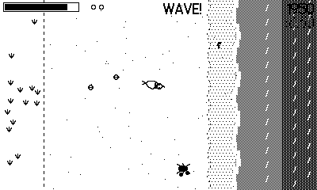

# Peckish

*A killdeer on the tideline.* A top-down beach-foraging game for Playdate.

**[Read the player's manual →](MANUAL.md)**



## Play it

Grab the prebuilt `Peckish.pdx` from the [Releases](../../releases) page
(or `dist/` in this repo) — no toolchain needed. Sideload it to a Playdate
at <https://play.date/account/sideload/>, or unzip and open it in the
Playdate Simulator that ships with the [Playdate SDK](https://play.date/dev/).

You are a killdeer — a little shorebird that sprints, stops, and pecks.
Worms surface in the sand, richest in the wet band a receding wave leaves
behind. Your metabolism never stops burning: walking costs energy, sprinting
costs more, and the only way to refill is to keep eating. Zero energy ends
the run.

## Controls

| Input | Action |
| --- | --- |
| D-pad | Scurry |
| B (hold) | Sprint — faster, but burns energy quicker |
| A | Peck (eat a surfaced worm; flip a crab, peck again to finish it) |
| Crank | Broken-wing display — slow, but lures the circling gull onto you |

## The beach

- **Waves** surge in from the right on a warning ("WAVE!" + the water pulls
  back). Get caught and you're tumbled and swept shoreward; chicks caught in
  the surge are washed away for good. Every receding wave leaves a fresh wet
  band that sprouts a burst of high-value worms — the best food is where the
  danger just was. Watch for rare **sneaker waves** that reach much further.
- **Crabs** scuttle out of the surf and race you to surfaced worms. Touching
  one costs a pinch; peck to flip it, peck the flipped crab for points.
- **The gull** circles its mark as a shadow — it prefers your chicks. Crank
  the broken-wing act to lure its dive onto you, then sprint clear as it
  commits: an empty grab is worth big points.
- **The jogger** pounds through the dry sand on a telegraphed lane. Get
  underfoot and you're bowled over and your flock scatters.

## The flock

Killdeer nest in bare scrapes: eggs appear near the dunes. Stand over one to
brood it until it hatches. Chicks trail behind you, snap up worms they walk
over (you get half the energy), and every chick adds +25% to all points —
but gulls and waves can take them.

## Building

```
make            # release build -> out/Peckish.pdx
make smoke      # instrumented build (autopilot + heartbeat datastore)
tools/smoke.sh  # headless simulator verification
```
